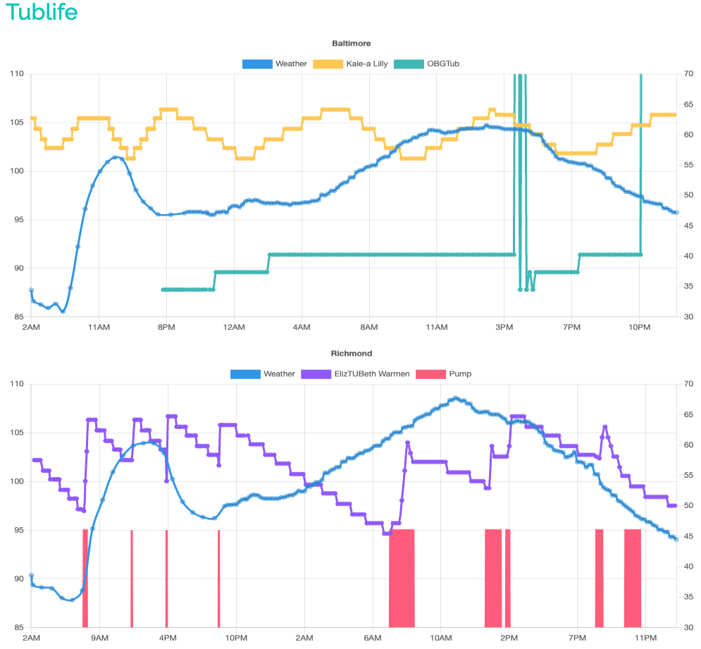

# Tublife



we're gonna push this to heroku & track the temps of the tubs

```ruby
reading_times = Reading.pluck(:created_at).map(&:beginning_of_hour).uniq
reading_times.each do |reading_at|
  Weather.history!("Baltimore", 39.290379, -76.61219, reading_at)
  Weather.history!("Richmond", 37.553761, -77.460258, reading_at)
end
```
